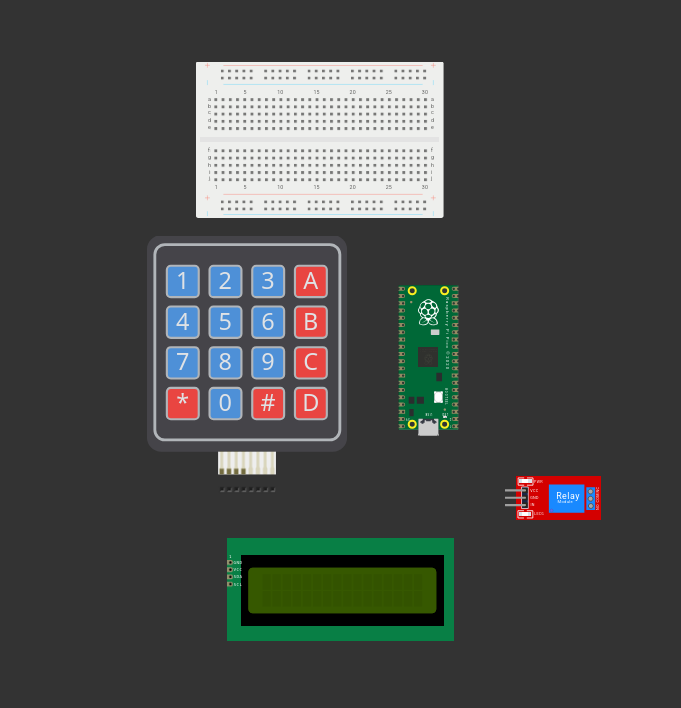

This is the finished version of the code. i will make the guide soon 

Guide:

Step 1: get the components 

Componets:
([Keypad 4x4 Matrix keypad**](https://www.amazon.de/AZDelivery-4x4-Matrix-Keypad-Tastatur/dp/B07D2FGQL4/ref=asc_df_B07D2FGQL4?mcid=d83246c06e88361b93eb7afb184e75bb&th=1&tag=googshopde-21&linkCode=df0&hvadid=696949000519&hvpos=&hvnetw=g&hvrand=14275680819693228858&hvpone=&hvptwo=&hvqmt=&hvdev=c&hvdvcmdl=&hvlocint=&hvlocphy=9042612&hvtargid=pla-835673982138&gad_source=1))

[I2C Display w/BUS**](https://www.amazon.de/AZDelivery-HD44780-Display-Zeichen-Schnittstelle/dp/B07V5K3ZVB/ref=sr_1_11?dib=eyJ2IjoiMSJ9.GSoynZq7OeAxuzqXqv4mFcrimB-RUqHUzUxbwn4uvYyUbCxbfDJv7AmTfhOiLj4tZgTP2cuf2tMp3zO8PiCHS1kEGQkRRZ7BdUEmEtDXlKku4EPgSsz79oyYBPoK4kVOFAMoFkxZDW7AaQ1L0y663QXK8CqTueGcPjj_RmShviAWxiAW3b1CJX8_LRUrqE0mJdXKevEqygwwynNR_x6yjIQut2Vw5nL_otEYrBQnk-I.W2OcuVHYjOiQrrL2PSCWePTMwS9qclDP6J4j-2Hxvnc&dib_tag=se&keywords=i2c%2Bdisplay&qid=1742495789&sr=8-11&th=1)

[Pi Pico 2*](https://www.amazon.de/Raspberry-Pi-Pico-RP2350-Mikrocontroller-Board/dp/B0DCKH85WR/ref=pd_day0fbt_d_sccl_2/260-9114744-0127210?pd_rd_w=hNDLZ&content-id=amzn1.sym.26fcca23-0cba-4d9b-ac73-10c54a86711c&pf_rd_p=26fcca23-0cba-4d9b-ac73-10c54a86711c&pf_rd_r=8YFE93XNGNZZ51GDQB0J&pd_rd_wg=dcf2n&pd_rd_r=3b0f1377-e4b8-4d80-a55f-f947ed7592c3&pd_rd_i=B0DCKH85WR&psc=1)

[Relay Switch**](https://de.aliexpress.com/item/1005002983784189.html?spm=a2g0o.productlist.main.17.5d24k6Yck6YcWP&algo_pvid=1161b2e7-fc17-4213-ad37-dc15b35de56d&algo_exp_id=1161b2e7-fc17-4213-ad37-dc15b35de56d-8&pdp_ext_f=%7B%22order%22%3A%222496%22%2C%22eval%22%3A%221%22%7D&pdp_npi=4%40dis%21EUR%211.15%210.99%21%21%218.88%217.65%21%40210390b817424963883272299e4ac2%2112000023061930640%21sea%21DE%210%21ABX&curPageLogUid=bkghhblmREkx&utparam-url=scene%3Asearch%7Cquery_from%3A)

*you can use any pi pico this is just my recommendation
**Check with the Footprint of the component no my guide the ports may vary for component to component

Step 2: 

Now solder the header pins to the pi pico(if you dont use a Breadboard make sure that the lines with the development board dont shortout eachother)
Now like in the Picture you connect the LCD display to the right GPIO Pins (you need VBUS since VBUS gives 5V but VBUS only works while it gets power over the usb port)

